# Learnify System Architecture Diagram

```mermaid
graph TB
    subgraph Frontend["🎨 FRONTEND LAYER"]
        Dashboard[Dashboard<br/>XP, Levels, Streaks]
        Friends[Friends<br/>Add, Message, Status]
        Groups[Study Groups<br/>Chat, DMs]
        AI[AI Tutor<br/>Learning Assistant]
        Notes[Smart Notes<br/>AI Summaries]
        Profile[Profile<br/>Stats, Achievements]
    end

    subgraph Services["⚙️ SERVICE LAYER"]
        AuthSvc[Authentication<br/>Service]
        FriendSvc[Friends<br/>Service]
        GroupSvc[Study Groups<br/>Service]
        MsgSvc[Messaging<br/>Service]
        GameSvc[Gamification<br/>Service]
    end

    subgraph Backend["🔧 BACKEND - SUPABASE"]
        Auth[Supabase Auth<br/>Google OAuth]
        DB[(PostgreSQL<br/>Database)]
        Realtime[Realtime<br/>WebSockets]
        Storage[Storage<br/>Media Files]
        RLS[Row-Level<br/>Security]
    end

    subgraph Database["🗄️ DATABASE SCHEMA"]
        Users[user_profiles]
        Friendships[friendships]
        StudyGroups[study_groups]
        Members[group_members]
        Messages[group_messages]
        Reactions[message_reactions]
    end

    %% Connections
    Dashboard --> AuthSvc
    Friends --> FriendSvc
    Groups --> GroupSvc
    Groups --> MsgSvc
    Dashboard --> GameSvc
    
    AuthSvc --> Auth
    FriendSvc --> DB
    GroupSvc --> DB
    MsgSvc --> DB
    MsgSvc --> Realtime
    GameSvc --> DB
    
    Auth --> Users
    DB --> Users
    DB --> Friendships
    DB --> StudyGroups
    DB --> Members
    DB --> Messages
    DB --> Reactions
    
    Realtime -.->|Live Updates| Groups
    Storage -.->|Images| Messages

    style Frontend fill:#1a1a2e,stroke:#CCFF00,stroke-width:3px
    style Services fill:#16213e,stroke:#A855F7,stroke-width:3px
    style Backend fill:#0f3460,stroke:#CCFF00,stroke-width:3px
    style Database fill:#0a1128,stroke:#A855F7,stroke-width:3px
```



## 🏗️ Architecture Overview

### Technology Stack

**Frontend:**
- React 18 + TypeScript
- Vite Build System
- Tailwind CSS + Framer Motion
- Zustand State Management

**Backend:**
- Supabase (Serverless)
- PostgreSQL 15
- WebSocket Real-time
- Google OAuth 2.0

---

## 📊 Data Flow Examples

### 1. User Login
```
User → Google OAuth → Supabase Auth → JWT Token → 
Create user_profile → Dashboard
```

### 2. Send Message
```
User → messagingService → INSERT group_messages → 
Trigger → Realtime → Broadcast → Recipients
```

### 3. Friend Request
```
Search User → Send Request → INSERT friendships → 
Notify → Accept → UPDATE status → Friends List
```

---

## 🎮 Key Features

| Feature | Status | Technology |
|---------|--------|-----------|
| Authentication | ✅ | Google OAuth |
| Friends System | ✅ | PostgreSQL + RLS |
| Group Chat | ✅ | Realtime + WebSockets |
| Direct Messaging | ✅ | Private Groups |
| Gamification | ✅ | XP, Levels, Badges |
| Real-time Updates | ✅ | Supabase Realtime |

---

## 🔒 Security

- **Row-Level Security** on all tables
- **JWT Authentication** with Supabase
- **HTTPS Only** connections
- **Input Sanitization** on all forms

---

## 🚀 Performance

- **Vite** for instant dev server
- **Lazy Loading** for routes
- **WebSocket** for real-time (not polling)
- **Indexed** database queries
- **CDN** for static assets
